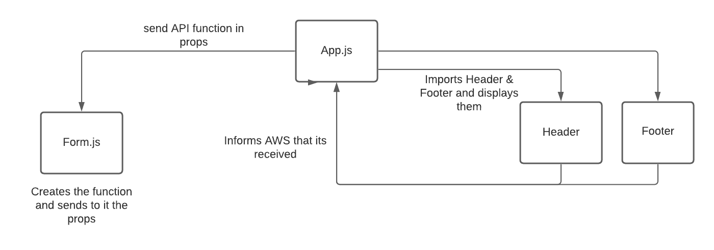

## RESTy
Our application will be an API testing tool that can be run in any browser, allowing a user to easily interact with APIs in a familiar interface.

PULL REQs:

https://github.com/yazanbaker94/resty/pull/2/

TEST: 
Gets the data after event has been fired and then checks if it contains the string value.

## UML Diagram:

